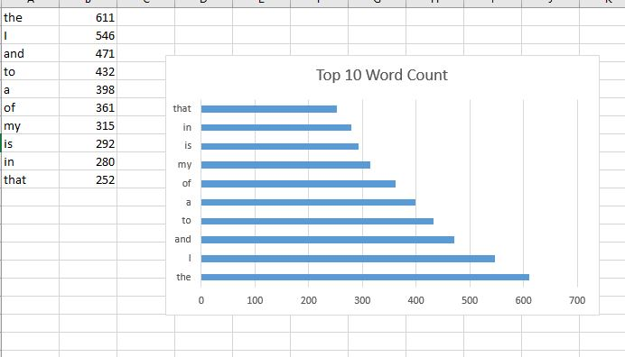

# bigdata-spark-wordcount

## Input file
- I have taken the input file from Dr.Case's repo: (https://github.com/denisecase/setup-spark)
- The data in the input file was cleaned already.
- Open Powershell as Administrator and run the below command to start Spark with Scala:<br>
```spark-shell```

### Step1: Creation of RDD using the input file
```scala> val rjRDD = sc.textFile("C:/rj.txt");```

### Step2: Words mapping & applying aggregation using reduceByKey
```scala> val totalWordsCount = rjRDD.flatMap(line => line.split(" ")).map(word => (word, 1)).reduceByKey((a, b) => a + b)```

### Step3: Displaying using collect()
```scala> totalWordsCount.collect()```

### Step4: Sorting in descending order
```scala> val descOrder = totalWordsCount.sortBy(_._2,false);```

### Step5: Function to write into file
```scala> def printToFile(f: java.io.File)(op: java.io.PrintWriter => Unit) { val p = new java.io.PrintWriter(f) try { op(p) } finally { p.close() } }```
                     
### Step6: Top 10 results
```scala> val top10Results = sortedResult.take(10);```

### Step7: Writing into a file "output.txt"
```scala> import java.io._```
```scala> printToFile(new File("C:/output.txt")) { p => top10Results.foreach(p.println) }```
## Word Count Visual Report


## References
- (https://github.com/denisecase/setup-spark)
- (https://blog.knoldus.com/sorting-in-scala-using-sortedsortby-and-sortwith-function/)
- (https://stackoverflow.com/questions/49067997/scala-write-rdd-to-txt-file)
